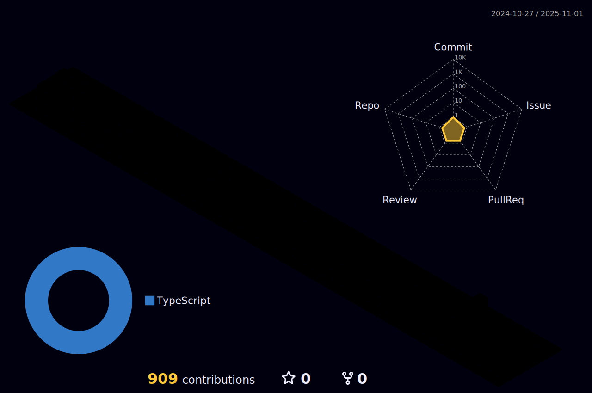

<h1>Hi there!</h1>

This is my personal website: <a href="https://matheustorres.dev/" target="_blank">https://matheustorres.dev/</a>

  
  

  
 |  |  |  
 | ----------- | ----------- |

 
  

   

  

 
##
   

     
  

  
 

 
  
  

  
